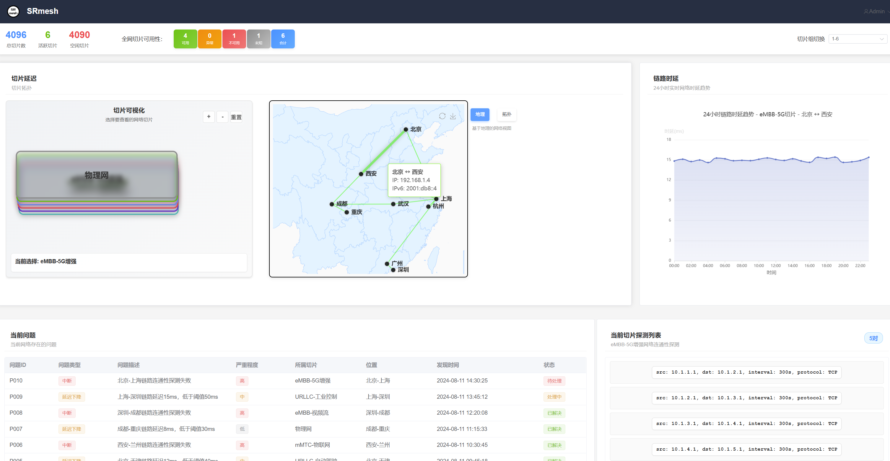

# SRmesh Network Slicing Management Frontend

**Code for the paper "SRmesh: Deterministic and Efficient Diagnosis of Latency Bottleneck Links in SRv6 Networks" in IEEE ICNP 2025**

This is the frontend demonstration project for the SRmesh, built with Vue 3 + TypeScript + Element Plus.



## 🔬 SRmesh Algorithm Integration

**Core Feature**: This system showcases SRmesh results integration:

- **🔗 Link Latency Generation**: SRmesh  algorithm analyzes network paths and generates optimized latency measurements for all connection pairs with 24-hour historical tracking (300-second intervals)
- **📡 Optimized Probe Lists**: The `pinglist` data contains SRmesh algorithm-optimized probe lists for each network slice, with slice-specific optimization and intelligent path selection
- **🔄 Latency Bottleneck Diagnosis**: Implements the deterministic and efficient diagnosis methodology presented in IEEE ICNP 2025 for identifying latency bottleneck links in SRv6 networks

⚠️ **Important Notice**: This project uses fictional data for demonstration purposes. All SRmesh algorithm results and network data are simulated for functionality showcase and do not represent real network environments. The network topology data is sourced from internet information and AI-generated random configurations.


## Quick Start

### Install Dependencies

```bash
npm install
```

### Start Development Server

```bash
npm run dev
```

### Start Backend Data Service (Optional)

To view latency data generated by SRmesh algorithm, start the backend data service:

```bash
# Initialize database with SRmesh algorithm results
cd database
mysql -u root -p < init.sql

# Generate SRmesh optimized latency data
python generate_data.py

# Start API service
node db-service.js
```